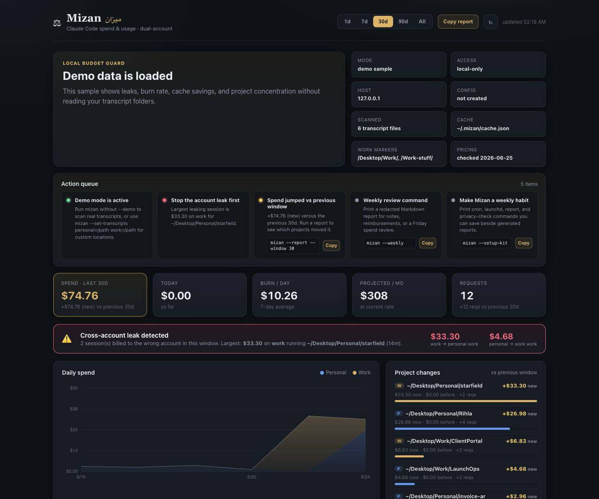

# Mizan (ميزان)

[](https://github.com/NasserAlbusaidi/mizan/actions/workflows/ci.yml)
[](https://github.com/NasserAlbusaidi/mizan/releases/latest)
[](LICENSE)

Local Claude Code spend dashboard with cross-account leak detection.

Mizan turns the JSONL transcripts already on your machine into a private budget
dashboard: daily spend, burn rate, top projects, model mix, cache efficiency, and
the mistake that actually hurts — work quota paying for personal projects, or the
other way around.

Zero runtime dependencies. No accounts. No upload. Local-only by default.
Node >= 20.



## Who it's for

Mizan is for Claude Code users who want a local answer to two practical
questions:

- "How much did this actually cost me this week?"
- "Did I accidentally spend the wrong account's quota on the wrong project?"

It is especially useful if you split personal and work usage across separate
Claude configs, run long-lived panes, or need a redacted weekly usage note for a
client, employer, or reimbursement log.

## Quick Start

Try a terminal demo without installing anything globally:

```bash
npm exec --yes --package github:NasserAlbusaidi/mizan#v0.1.44 -- mizan --try
```

Save a sample weekly report without installing globally:

```bash
npm exec --yes --package github:NasserAlbusaidi/mizan#v0.1.44 -- mizan --weekly --demo --output "$HOME/Documents/Mizan/mizan-demo-weekly.md"
```

Install the current GitHub release from its pinned tag:

```bash
npm install -g github:NasserAlbusaidi/mizan#v0.1.44
```

If your npm client cannot install from GitHub tags, use the versioned release
tarball:

```bash
npm install -g https://github.com/NasserAlbusaidi/mizan/releases/download/v0.1.44/nasseralbusaidi-mizan-0.1.44.tgz
```

Preview the dashboard without reading local transcripts:

```bash
mizan --demo
```

Then check whether Mizan can see your transcripts:

```bash
mizan --setup
```

Start the private local dashboard:

```bash
mizan
```

If the dashboard starts with zero records, preview the product with
`mizan --demo`, diagnose folders with `mizan --setup`, or save custom transcript
folders with `mizan --set-transcripts personal=/path work=/path`.

From the public GitHub source:

```bash
git clone https://github.com/NasserAlbusaidi/mizan.git
cd mizan
node bin/mizan.js --setup
npm start
```

The npm package is prepared but not published yet. The
`npx @nasseralbusaidi/mizan` path is available after npm publish:

```bash
npx @nasseralbusaidi/mizan --setup
npx @nasseralbusaidi/mizan --demo
npx @nasseralbusaidi/mizan
```

`mizan --setup` creates `~/.mizan/config.json` when it is missing, prints the
same diagnostics as `mizan --doctor`, and exits with code `2` when no parseable
Claude usage records are found.
When setup cannot find transcripts yet, it points to the sample report artifact:

```bash
mizan --weekly --demo --output "$HOME/Documents/Mizan/mizan-demo-weekly.md"
```

Check without writing config:

```bash
mizan --doctor
```

From an existing local checkout:

```bash
npm start
```

First run parses every transcript; after that it is incremental. Mizan warms a
small cache, starts `http://127.0.0.1:7777`, opens the browser, and refreshes the
dashboard every 15 seconds.

If the dashboard is empty or the account split looks wrong, save the transcript
folders once:

```bash
mizan --set-transcripts \
  personal="$HOME/.claude/projects" \
  work="$HOME/.claude-work/projects"
```

If your work repos live somewhere else, add a marker that appears in their paths:

```bash
mizan --add-work-marker /Clients/
```

## CLI

```bash
mizan --no-open
mizan --port 7788
mizan --host 0.0.0.0
mizan --try
mizan --today
mizan --weekly
mizan --summary --window 1
mizan --json --window 7
mizan --csv --window 7
mizan --demo
mizan --setup
mizan --doctor
mizan --doctor --check
mizan --setup-kit
mizan --init-config
mizan --set-budget daily=20 monthly=250
mizan --add-work-marker /Clients/
mizan --set-transcripts personal="$HOME/.claude/projects" work="$HOME/.claude-work/projects"
mizan --support-bundle
mizan --feedback
mizan --share
mizan --pricing
mizan --summary
mizan --report
mizan --check
mizan --version
mizan --help
```

`mizan --try` prints a demo spend summary, a no-global sample report command,
current GitHub install command, versioned tarball fallback, and next setup
commands without opening a browser or reading local transcripts. It is the
fastest way to decide whether Mizan is worth installing. The demo intentionally
includes leaks, so a `[FAIL]` status means the detector is being shown.

`mizan --weekly` prints the same redacted 7-day Markdown report as
`mizan --report --window 7`. It is the shortest command for a recurring review
or reimbursement note. Demo reports include next steps for installing Mizan,
checking real transcript setup, and saving the first real weekly report.

`mizan --csv` prints a redacted account/project/session CSV for reimbursement
spreadsheets, client notes, or internal usage logs. It uses the same window
selection as reports, so `mizan --csv --window 7` matches the weekly report
window.

`mizan --setup` is the one-command first run. It creates the local config if
needed, prints setup diagnostics, and exits with code `2` when Mizan still
cannot see any parseable Claude usage records. When setup is usable, it prints
the copyable saved-report command:

```bash
mizan --weekly --output "$HOME/Documents/Mizan/mizan-weekly-$(date +%F).md"
```

`mizan --doctor` is the first thing to run when the dashboard looks empty. It
prints the transcript folders Mizan can see, how many `.jsonl` files and
parseable usage records were found, the cache path, bind host, work markers, and
the next setup step. If a saved or environment-provided transcript path is
wrong, it checks the common Claude Code defaults and suggests a copyable
`mizan --set-transcripts ...` command when it finds parseable usage there.
For one-account users, one transcript folder is enough; the second account is
optional unless you split personal and work Claude configs.
Use `mizan --doctor --check` in scripts when setup should fail with exit code
`2` unless at least one transcript folder has parseable usage records.

`mizan --setup-kit` prints a copyable weekly review setup kit: first-run checks,
report commands, cron, launchd, and privacy reminders. Use
`mizan --setup-kit --output "$HOME/Documents/Mizan/setup-kit.md"` if you want to
save it beside generated reports.

`mizan --init-config` creates `~/.mizan/config.json` with editable defaults.

`mizan --set-budget daily=20 monthly=250` creates or updates the persistent
config with spend limits for the dashboard action queue and `mizan --check`.
Use `daily=off` or `monthly=unset` to clear a saved budget.

`mizan --add-work-marker /Clients/` appends path fragments that should count as
work projects for leak detection. This is the command to run when your work
repos live outside the default `/Desktop/Work/` or `/Work-stuff/` paths.

`mizan --set-transcripts personal=... work=...` persists the transcript project
folders Mizan scans, so you do not have to keep exporting `MIZAN_PERSONAL_DIR`
or `MIZAN_WORK_DIR`.

`mizan --support-bundle` prints a redacted support bundle with version, runtime,
and setup diagnostics. It is the safest thing to paste into an issue when setup
looks wrong.

`mizan --feedback` prints the GitHub issue link, the redacted support-bundle
command, and a privacy checklist for safe bug reports or adoption feedback.

`mizan --share` prints safe public launch copy with the current GitHub-tag demo
and install commands. It does not scan transcripts or start the dashboard.

`mizan --pricing` prints the static pricing table Mizan uses for estimates.

`mizan --summary` prints a compact terminal report for the selected window.
`mizan --report` prints a redacted Markdown report for weekly reviews, cron
logs, or copy/pasting into a note without exposing absolute local paths.
For finite windows, both commands compare spend and request count against the
previous matching window. Markdown reports also list project-level spend movers,
so a 7-day report shows which projects changed since the prior 7 days.
When cross-account leaks are found, summaries and reports call out the
reviewable wrong-account spend as a plain dollar amount.
`mizan --check` prints the same report and exits with code `2` when Mizan finds
cross-account leaks or spend that exceeds configured budgets.
If a summary finds zero usage records, Mizan reports `WARN` and points you to
`mizan --doctor`, `mizan --demo`, and `mizan --set-transcripts` rather than
pretending an empty setup is clean.

Examples:

```bash
mizan --today
mizan --weekly
mizan --weekly --output "$HOME/Documents/Mizan/mizan-weekly.md"
mizan --csv --window 7 --output "$HOME/Documents/Mizan/mizan-weekly.csv"
mizan --summary --window 1
mizan --summary --window 7
mizan --report --window 7
mizan --report --window 7 --output "$HOME/Documents/Mizan/mizan-weekly.md"
mizan --report --json --window 30
mizan --report --check --window 7
mizan --setup
mizan --set-budget daily=20 monthly=250
mizan --add-work-marker /Clients/
mizan --set-transcripts personal="$HOME/.claude/projects" work="$HOME/.claude-work/projects"
mizan --support-bundle --output "$HOME/Documents/Mizan/support-bundle.md"
mizan --feedback
mizan --setup-kit --output "$HOME/Documents/Mizan/setup-kit.md"
mizan --doctor --check
MIZAN_DAILY_BUDGET=20 MIZAN_MONTHLY_BUDGET=250 mizan --check
mizan --check --json --window 30
```

Use `--report --check` in scheduled jobs when you want a Markdown report in the
logs and a failing exit code whenever leaks or budget overruns need attention.
Add `--output path/to/report.md` to save one-shot output from `--report`,
`--csv`, `--summary`, `--today`, `--weekly`, `--json`, `--setup`, `--doctor`,
`--setup-kit`, `--pricing`, `--support-bundle`, `--feedback`, or `--share`
without shell redirection; parent directories are created automatically.

For recurring reviews, automation examples, and reimbursement note templates,
see the [Setup Kit](docs/SETUP_KIT.md). For demo flow and public post copy, see
the [Launch Kit](docs/LAUNCH_KIT.md).

## What it shows

- **Action queue** — leaks, spend jumps, budgets, and setup commands worth
  checking before reading charts.
- **Weekly review command** — copy `mizan --weekly` from the action queue for
  redacted recurring notes.
- **Copy or save report** — one-click redacted Markdown from the dashboard for
  notes, status updates, or reimbursements.
- **Save CSV / CSV export** — redacted account, project, and costliest-session
  rows from the dashboard or CLI for spreadsheets and internal/client usage
  logs.
- **Headline KPIs** — spend in window, previous-window trend, today, 7-day burn
  rate, projected monthly spend, request count.
- **Project changes** — top projects that drove spend up versus the previous
  matching window, shown directly in the dashboard.
- **Account split** — personal vs work, the thing that moves the bill.
- **Daily spend** — stacked area by account.
- **Leak detection** — sessions billed to one account whose project belongs to the
  other. This is the thing that silently burned ~$978 of work quota when a forgotten
  pane ran the personal Rihla project on work credentials for 14 hours. It also catches
  the reverse: personal quota spent on `~/Desktop/Work/` projects. Summaries
  and reports show the reviewable wrong-account spend as a dollar amount.
- **Model mix**, **top projects**, **cache efficiency**, and costliest sessions.
- **Redacted Markdown reports** — copyable weekly spend snapshots that omit full
  home paths while preserving the useful project/account breakdown,
  account split, costliest sessions, project-level movers, and previous-window
  comparison.

## Privacy Model

Mizan serves a local dashboard and reads these folders by default:

| Account | Default folder |
|---|---|
| Personal | `~/.claude/projects` |
| Work | `~/.claude-work/projects` |

If `CLAUDE_CONFIG_DIR` is set, Mizan treats `${CLAUDE_CONFIG_DIR}/projects` as
the personal transcript folder unless `MIZAN_PERSONAL_DIR` is set.

The persistent files Mizan writes live under `~/.mizan/`:

- `config.json` when you run setup commands such as `--setup`, `--set-budget`,
  `--add-work-marker`, `--set-transcripts`, or `--init-config`
- `cache.json`, the incremental parse cache

The dashboard binds to `127.0.0.1` by default, so the browser talks to a
local-only server. Use `mizan --host 0.0.0.0` or `MIZAN_HOST=0.0.0.0` only when
you intentionally want LAN access on a trusted network.

## Support

When reporting an issue, run `mizan --feedback` first. It prints the GitHub issue
link, the redacted support-bundle command, and the privacy checklist. Include
`mizan --version`, your OS, Node version, install method, the command you ran,
what you expected, and what happened.

For setup problems, run `mizan --support-bundle` to generate a redacted support
bundle without raw transcripts or full home paths.

See [SUPPORT.md](SUPPORT.md), [SECURITY.md](SECURITY.md), and
[CONTRIBUTING.md](CONTRIBUTING.md) before opening public issues or patches.

## Pricing — read this

This tool uses Anthropic Claude API public per-MTok pricing checked on
2026-06-25:

| Model | Input | Output |
|---|---|---|
| Fable 5 | $10 | $50 |
| Mythos 5 | $10 | $50 |
| Opus 4.5–4.8 | **$5** | **$25** |
| Opus 4.1 / 4.0 | $15 | $75 |
| Sonnet 4.6 | $3 | $15 |
| Haiku 4.5 | $1 | $5 |
| Haiku 3.5 | $0.80 | $4 |

Cache tiers are derived: read = 0.1× input, write-5m = 1.25×, write-1h = 2×.
Mizan uses standard global Claude API rates and does not apply fast mode, batch,
partner cloud, or data residency multipliers.
Unmatched non-synthetic models are priced at `$0` and shown as unpriced warnings
in the dashboard, summary, and report so totals are not trusted silently.

> ⚠️ The older `~/.local/bin/claude-usage` script hardcodes every Opus request at
> **$15/$75**. That is correct for retired/deprecated Opus 4.0/4.1 records, but
> Opus 4.5+ is **3× cheaper** at **$5/$25**. Mizan separates those generations so
> old transcript history is not undercounted and current Opus usage is not
> overstated. Authoritative billing is still console.anthropic.com — this is a
> local estimate.

Pricing source: https://docs.anthropic.com/en/docs/about-claude/pricing
Claude Code cost model: https://docs.anthropic.com/en/docs/claude-code/costs

## Configuration

Create a persistent config template:

```bash
mizan --init-config
```

Mizan reads `~/.mizan/config.json` by default. Environment variables still win,
so one-off shell overrides remain possible. Set `MIZAN_CONFIG=/path/to/config.json`
to use a different file.

Config file shape:

```json
{
  "personalDir": "/Users/you/.claude/projects",
  "workDir": "/Users/you/.claude-work/projects",
  "workMarkers": ["/Desktop/Work/", "/Work-stuff/"],
  "dailyBudget": null,
  "monthlyBudget": null,
  "port": 7777,
  "host": "127.0.0.1"
}
```

| Env var | Default | Purpose |
|---|---|---|
| `MIZAN_PORT` | `7777` | Server port |
| `MIZAN_HOST` | `127.0.0.1` | Server bind host; use `0.0.0.0` only for intentional LAN access |
| `MIZAN_CONFIG` | `~/.mizan/config.json` | Config file path |
| `MIZAN_PERSONAL_DIR` | `~/.claude/projects` or `${CLAUDE_CONFIG_DIR}/projects` | Personal transcript projects directory |
| `MIZAN_WORK_DIR` | `~/.claude-work/projects` | Work transcript projects directory |
| `MIZAN_WORK_MARKERS` | `/Desktop/Work/,/Work-stuff/` | Path fragments that mark a project as "work" (drives leak direction) |
| `MIZAN_DAILY_BUDGET` | unset | Optional daily spend budget in USD |
| `MIZAN_MONTHLY_BUDGET` | unset | Optional projected monthly spend budget in USD |

If your work checkout lives somewhere else:

```bash
mizan --add-work-marker /Clients/
```

For one-off shell overrides:

```bash
MIZAN_WORK_MARKERS="/Clients/,/Company/" mizan
```

If you want the action queue to warn against your own limits:

```bash
mizan --set-budget daily=20 monthly=250
```

For one-off budget overrides:

```bash
MIZAN_DAILY_BUDGET=20 MIZAN_MONTHLY_BUDGET=250 mizan
```

If your transcripts live somewhere else:

```bash
mizan --set-transcripts \
  personal="$HOME/.claude/projects" \
  work="$HOME/.config/claude-work/projects"
```

For one-off transcript overrides:

```bash
MIZAN_PERSONAL_DIR="$HOME/.claude/projects" \
MIZAN_WORK_DIR="$HOME/.config/claude-work/projects" \
mizan
```

## Smoke Test

From a checkout, run:

```bash
npm run smoke
```

That checks setup diagnostics and verifies the demo JSON path without opening a
browser.

Before publishing, run:

```bash
npm run release:check
```

`npm run install:check` also verifies the packed tarball in a temporary clean
npm project, which catches broken `bin` or missing packaged files before publish.

## How it's verified

- **Pricing** is table-driven and unit-tested (clean / partial / zero / unknown cases).
- **Extraction & dedup** were differential-tested against an independent Python
  reimplementation: time-bounded to exclude the live session, both accounts match to the
  digit on request count, input, cache-creation, and cache-read tokens.
- `npm test` runs the full suite.

## Layout

```
bin/mizan.js        entry — warm cache, start server, open browser
src/config.js       paths, account model, project classification
src/doctor.js       setup diagnostics for transcript folders and work markers
src/pricing.js      cost computation, pricing metadata, pricing CLI report
src/summary.js      terminal summary/check report model
src/report.js       redacted Markdown/JSON report model
src/support-bundle.js redacted support diagnostics
src/feedback.js     safe issue-reporting guide
src/parser.js       one transcript line -> usage record
src/scanner.js      walk dirs + incremental mtime cache
src/cache.js        ~/.mizan/cache.json
src/aggregate.js    rollups + burn + cache efficiency + leaks
src/leaks.js        cross-account leak classification
src/engine.js       scan -> aggregate, with a short memo
src/server.js       zero-dep HTTP + JSON API
public/             dashboard (index.html, styles.css, app.js, charts.js)
test/               pricing + aggregate/leak tests
```
